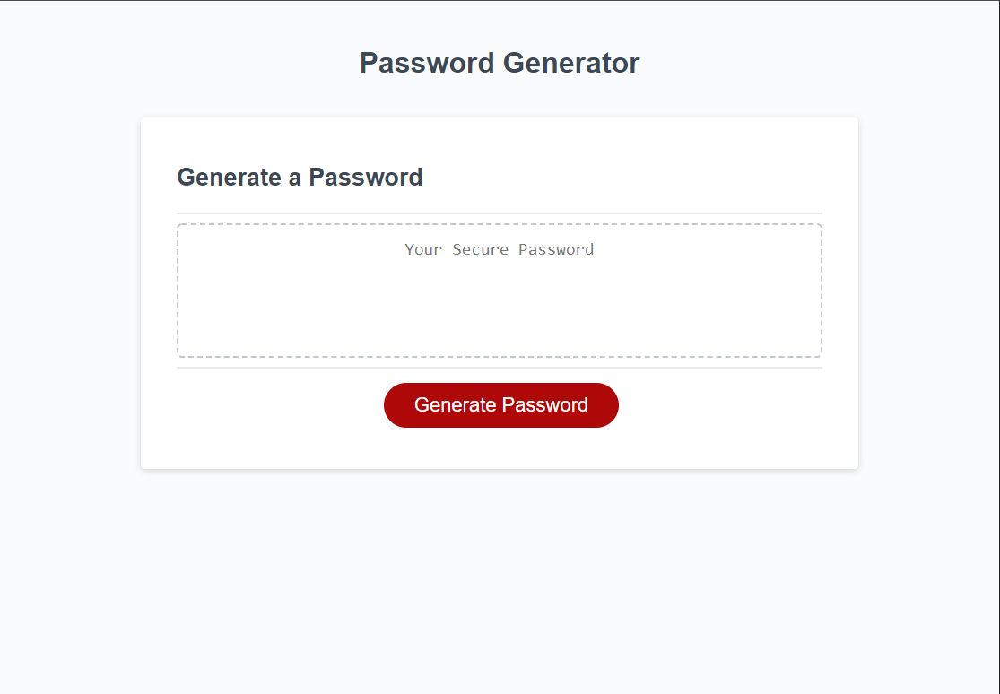

Description of application:
The web application I was working on was a password generator that needed to have several parameters that the user could choose from. The required parameters is that the application ask the users for lenght of password, and it it will include lowercase,uppercase, numbers and special characters. 

I learned a great deal on how to assign variables and how to push the results of functions into variables so the result can be pushed into the text-box and display the user generated password. 

Their was a few challenges that I encountered that made this a challenging assignment. I was having a hard time getting anything to console log, meaning that I wasnt correct in the way the variables would push into the log. Once I was able to clean my code and fix some aspects of the for loop I was able to get an 'undefined' reading which was a great sign because I knew I was getting closer to making the code work. My main issue was getting the "buckets" I created to pull the var that were set by the booleans in the beginning of the code.

I was helped immensely by TA Nicholas Gambino, he helped me in office hours to debug the reason the user-password wasnt pushing into my assigned array. We went over for loops and even had a few times when we had infinate loops. But with patience we were able to see that we didn't set the parameters in the for loop to stop at the password length.

